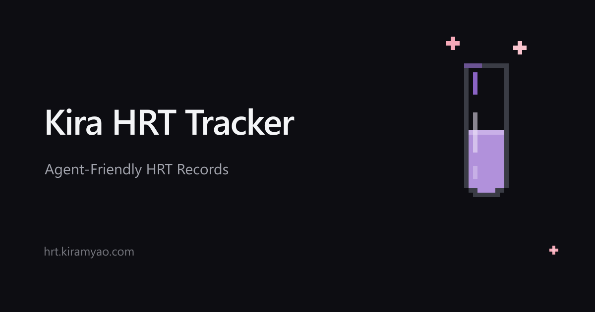
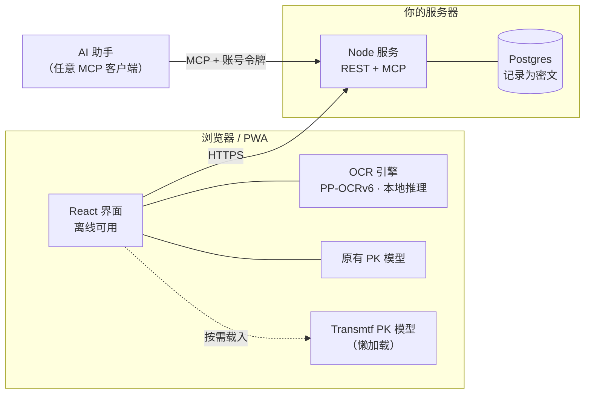

# Kira HRT Tracker



HRT 记录工具：记录用药与化验，估算激素水平随时间的变化，并让 AI 助手通过 MCP 读写这些记录。

An HRT tracker: log doses and lab results, estimate hormone levels over time, and let an
AI assistant read and write those records over MCP.

出品 **[KiraEqual](https://kiramyao.com)** · 服务状态 <https://status.kiramyao.com>

```
Node + Postgres  ·  per-account AES-256-GCM  ·  可自托管  ·  MIT
```

---

## 它是什么 / What it is

一个自己托管的激素记录工具。核心是**用药记录 → 药代动力学估算 → 化验结果校准**这条闭环：记下给药途径、酯类、剂量和时间，模型推算血药浓度随时间变化的曲线；抽血之后把结果填进去，模型再调整成更贴近你本人的参数。

数据存在**你自己的服务器**上，每条记录用**该账号自己的密钥**加密。没有第三方分析、没有广告、不把记录上传给任何模型厂商——AI 助手是通过**你签发的令牌**访问**你自己的实例**。

A self-hosted hormone tracker built around one loop: log a dose → the model estimates the
concentration curve → your lab results tune the model toward you. Records live on **your
server**, encrypted under **each account's own key**. No analytics, no ads, nothing sent
to a model vendor — an assistant reaches **your** instance with a token **you** issue.

---

## 与 Oyama's HRT Tracker 的区别 / How it differs from the fork

本项目**分叉自 [Oyama's HRT Tracker](https://github.com/xunxunProjects/Oyama-s-HRT-Tracker)**（MIT，原始声明完整保留在 [`LICENSE`](LICENSE)）。分叉之后几乎重写了持久层与界面：

This project **forks [Oyama's HRT Tracker](https://github.com/xunxunProjects/Oyama-s-HRT-Tracker)**
(MIT; the original notice is preserved intact in [`LICENSE`](LICENSE)). The persistence
layer and the interface were largely rewritten after the fork:

| | Oyama's | 本项目 / This project |
|---|---|---|
| **数据存放** | 浏览器本地 / Cloudflare Worker + D1 + R2 | 自托管 **Node + Postgres**，记录按账号封装为 AES-256-GCM 密文 |
| **登录** | 无账号 | 密码 + **Passkey** + X / Google，可互相绑定 |
| **AI 接入** | 无 | **MCP**，19 个工具 |
| **模型** | 单一 | **两套可选**，带个体化校准 |
| **多语言** | 英文 | **7 种**，按需加载 |
| **化验单** | 手动输入 | **本地 OCR**（模型在你自己的域名下） |
| **部署** | Cloudflare 全家桶 | 任意 web 服务器 + Node，无容器、无 Worker |

一句话：**Oyama 的版本是纯前端小工具；本项目把它做成可以自己运营的多用户服务**，代价是一台服务器和一个 Postgres。

In one line: **Oyama's is a pure-front-end tool; this is that idea grown into a
multi-user service you can operate yourself** — at the cost of a box and a database.

---

## 两套药代动力学模型 / The two PK models

曲线由模型算出，而模型是**别人**的工作。两套可在「设置 → 常规设置」随时切换，选择随账号同步。

The curve comes from a model, and the model is **someone else's work**. Two are offered,
switchable any time in Settings → General, and the choice follows the account.

| 模型 | 来源 | 特点 |
|---|---|---|
| **原有模型** | [@LaoZhong-Mihari](https://github.com/LaoZhong-Mihari/HRT-Recorder-PKcomponent-Test) 的 `PKcore.swift` / `PKparameter.swift` | 本应用一直使用的模型，直接移植：三室模型、双相肌注库房动力学、舌下吸收分层 |
| **Transmtf 模型** | [Transmtf Team](https://github.com/TransmtfTeam/Transmtf-HRT-Tracker)（MIT） | 在同一套算法上扩展：三级室凝胶吸收、两相注射释放、EU 长效剂型、CPA / 比卡鲁胺，带个体化校准 |

两套模型**算出的曲线不同**——这不是 bug，正是提供选择的原因。注射类两者往往一致（同源参数），凝胶与舌下差异明显。Transmtf 引擎**只建模雌二醇**，故在男性化模式下不可选。

The two draw **different curves**, which is the point rather than a defect: injections
tend to agree (same upstream parameters), gel and sublingual diverge. The Transmtf engine
models **estradiol only**, so it is not offered in masculinising mode.

**个体化校准**同样各有一套：MAP 拟合、扩展卡尔曼滤波（EKF）、Ornstein–Uhlenbeck 动态校准。原理是拿你的化验值反过来调整模型参数，让估算从「人群平均」走向「你本人」。

**Personal calibration** is likewise per-engine: MAP fitting, an EKF, and an
Ornstein–Uhlenbeck filter. Your own labs adjust the model's parameters, moving the
estimate from *population average* toward *you*.

> ⚠️ 估算来自群体药代模型，**不是化验结果**，不能作为用药依据。要准确知道血药浓度只能去抽血，请以医院报告为准。
>
> The estimate is a population model, **not a measurement**. It must not drive a dosing
> decision. The only way to know your level is a blood test.

---

## 架构 / Architecture



- **加密在服务端发生**。记录以账号自己的数据密钥（DEK）加密后落库；密钥由密码包裹。服务端在会话存活期间持有密钥，所以刷新不掉登录；登出或空闲超时即释放。
- **会话令牌就是密钥持有者**。客户端不自己保管密钥，每次读取都经过服务端。
- **MCP 与 REST 共用同一套权限模型**。助手只能用你签发的令牌做令牌范围内的事。

<!--
- **Encryption happens server-side.** Records are sealed under the account's own data
  key and stored as ciphertext; the key is wrapped by the password. The server holds it
  for the session's lifetime, which is why a refresh does not sign you out and why
  signing out (or idling out) releases it.
- **The session token *is* the key holder.** The client keeps no key of its own.
- **MCP and REST share one permission model.** A token bounds what an assistant can do.
-->

---

## 功能 / Features

**记录** 剂量（注射 / 口服 / 舌下 / 凝胶 / 贴片）、化验结果、体感日记、快捷记录、批量添加、导入导出。

**估算** 浓度曲线、当前水平、剂量级别参考、监测提醒（按 MtF.wiki 的建议周期）、抗雄激素累计量与再检查提醒。

**化验单识别** 拍下化验单本地识别；模型与字典都从**你自己的域名**加载，图片不出设备。

**账号** 密码、Passkey、X / Google 绑定、设备会话列表、云端同步、数据导出与删除。

**分享** 生成只读链接给医生或朋友，可设过期与密码，且**只含你选择分享的内容**。

**多语言** 7 种，非默认语言按需下载。

---

## 连接 AI 助手 / Connect an assistant

服务端实现了 [MCP](https://modelcontextprotocol.io)。签一个令牌，填进客户端配置：

```json
{
  "mcpServers": {
    "hrt": {
      "type": "http",
      "url": "https://your-api-host/hrt/mcp",
      "headers": { "Authorization": "Bearer hrt_..." }
    }
  }
}
```

19 个工具：`hrt_get_timeline`、`hrt_add_medication`、`hrt_add_lab_result`、`hrt_predict_levels`、`hrt_check_advisories`、`hrt_sync_state`、`hrt_create_share` 等。工具**清单**可匿名读取（只含 schema，不含任何账号数据），**调用**一律需要令牌。令牌可撤销、可设过期；**改密码会一次性终止全部令牌**。

---

## 本地运行 / Run locally

```bash
npm install
npm run dev              # http://localhost:3000
```

后端需要 Postgres，见下。

---

## 自行托管 / Self-hosting

前端是静态构建产物，后端是 `server/` 里的 Node 服务，只需要一个 Postgres。

```bash
# 前端：必须带 API 源构建
VITE_API_ORIGIN=https://your-api-host/hrt npm run build
```

**这个变量不能省。** 不带的话所有请求变同源，静态主机用 SPA 外壳回一个 HTTP 200，应用把「读不出来」当成「没配置」，于是 OAuth 按钮**静默消失**——没有任何报错。构建会自检这一点（`scripts/check-web-bundle.mjs`），缺失即在构建阶段失败。

<!-- The variable cannot be omitted: without it every request goes same-origin, the
static host answers with the SPA shell and HTTP 200, the app reads an unreadable
response as "no provider configured", and the OAuth buttons vanish silently. The build
checks for this itself and fails rather than shipping it. -->

后端最小配置：`DATABASE_URL`、`ENCRYPTION_KEY`、`SERVER_DEK_KEY`、`PUBLIC_ORIGIN`、`API_ORIGIN`、`BASE_PATH`。

完整手册在 **[`server/DEPLOY.md`](server/DEPLOY.md)**：数据库与角色、systemd 单元、Caddy 站点配置、部署前检查。**首次部署前请先读它**——其中几条警告来自这个项目真实发生过的事故，包括「看起来部署成功、用户拿到的却还是旧构建」。

两把密钥也可以放进 **systemd 加密凭据**而非 `.env`，这样它们不与所保护的数据同处一块磁盘。

---

## 开源项目与许可 / Open source and licences

所使用的工作及各自许可完整收录在 **[`THIRD-PARTY-LICENSES.md`](THIRD-PARTY-LICENSES.md)**；应用内「设置 → 关于 → 开源许可」也逐条列明。

### 药代动力学模型 / PK models

| 项目 | 许可 |
|---|---|
| [HRT-Recorder-PKcomponent-Test](https://github.com/LaoZhong-Mihari/HRT-Recorder-PKcomponent-Test)（@LaoZhong-Mihari） | 仓库未声明许可；**版权持有人已单独授予本项目非商业使用许可**（2026-09-18）。**据此本项目不得用于收费产品或任何形式的商业化** |
| [Transmtf-HRT-Tracker](https://github.com/TransmtfTeam/Transmtf-HRT-Tracker) | MIT |
| [Oyama's HRT Tracker](https://github.com/xunxunProjects/Oyama-s-HRT-Tracker) | MIT（分叉来源） |
| [HRT-Recorder-online](https://github.com/LaoZhong-Mihari/HRT-Recorder-online) | 未声明 |

> **非商业许可是真实限制，不是套话。** 若要用于收费产品，必须先与版权持有人重新协商。

### 医学引用 / Medical sources

剂量范围、监测建议与部分模型参数来自以下来源——**引用其结论与数字，未转载其内容**：

| 来源 | 许可 |
|---|---|
| [MtF.wiki](https://mtf.wiki/) | CC BY-SA 4.0 |
| [Transfeminine Science](https://transfemscience.org/) | **保留所有权利**。本项目仅引用其公布的剂量范围与结论，并在应用内链接回原页面；未转载文章内容 |

<!-- The dose ranges, monitoring intervals and a few model parameters come from these
two. What is used is their published figures and conclusions, never their prose; each
is linked where it is used. The Transfeminine Science reservation is recorded as it
stands — "reference" is not a licence and this file should not imply one. -->

### 其他 / Other

运行时依赖（React、ONNX Runtime Web、jsPDF 等）的许可由 `scripts/gen-licences.mjs` 从 `package.json` 与各包的 `license` 字段**自动生成**，不手工维护——手工列表在第一次添加依赖时就会失真。图标来自 Reicon，OCR 模型来自 PP-OCRv6。

---

## 测试 / Tests

项目不用测试框架，用可运行的断言脚本。每个都对应一个**真实发生过的 bug**：

No test framework — runnable assertion scripts, each guarding a bug that actually
happened here:

```bash
node scripts/check-i18n-coverage.mjs                                # 7 语言 0 缺口
node --experimental-transform-types scripts/check-sync-merge.mjs    # 合并与墓碑规则
node scripts/check-sync-coalesce.mjs                                # 同步并发与账号隔离
node --experimental-transform-types scripts/check-pk-engine.mjs     # 两套引擎的适配层
node --experimental-transform-types scripts/check-vial-level.mjs    # 试管的像素几何
cd server && npm test                                               # 服务端（需 Postgres）
```

---

## 许可 / Licence

本仓库以 **MIT** 发布；分叉来源的原始声明完整保留在 [`LICENSE`](LICENSE)。

**但注意上游模型的非商业限制**：本仓库代码本身是 MIT，然而它依赖的药代动力学模型带有非商业条款，这限制了*整个应用*可以怎么用。详见 [`THIRD-PARTY-LICENSES.md`](THIRD-PARTY-LICENSES.md)。

This repository is **MIT**, with the fork's original notice preserved in
[`LICENSE`](LICENSE). **Note the upstream model's non-commercial limit**: the code here
is MIT, but the pharmacokinetic model it depends on carries non-commercial terms, and
that constrains how the *whole application* may be used.
