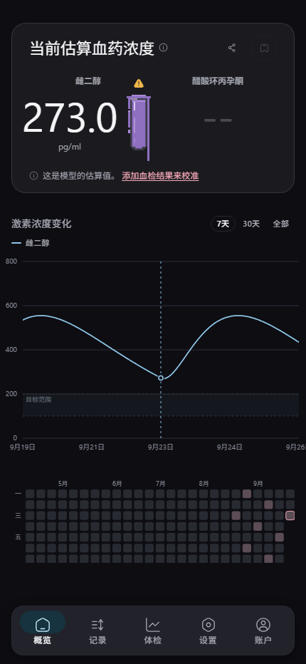
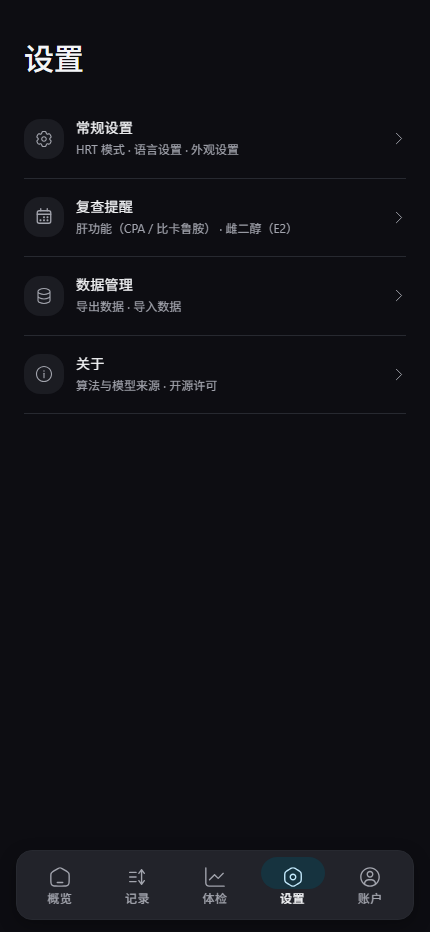

# Kira HRT Tracker

记录 HRT 用药与化验，估算激素水平随时间的变化，让 AI 助手通过 MCP 读写你的记录。

<p align="center">
  
  
</p>

出品 **[KiraEqual](https://kiramyao.com)** · 服务状态 <https://status.kiramyao.com>

> ⚠️ 本应用的估算来自**群体药代动力学模型**，不是化验结果，**不能作为用药依据**。要准确知道血药浓度只能去抽血，请始终以医院报告为准。

---

## 这是什么

一个记录 HRT 的软件。核心是一条闭环：

**记下用药 → 模型估算血药浓度曲线 → 抽血后把结果填进去 → 模型调整得更贴近你本人**

它特别适合这样的人：正在用注射或凝胶，想知道「这周的血药浓度大概在什么水平」「下次该什么时候抽血」「上次那个剂量是不是偏高」，并且希望这些记录和 AI 助手一起用。

## 怎么用

1. **第一次打开**会有一个简短的引导，介绍一下它是干什么的。语言和 HRT 模式选一次就好，之后可以在设置里改。
2. **记录第一条用药**：填给药途径、药物、剂量和时间。以后常用的话存成模板，首页就能一键记。
3. **看概览页**：当前的估算浓度、随时间变化的曲线，以及用药日历。
4. **去抽血后**把结果填进「体检」页。有两条以上的结果，模型就会开始**按你的数据校准**，曲线会更贴合你。
5. **想要 AI 助手帮忙**就签一个令牌（见下），让它读你的记录、帮你算、提醒你复查。

数据默认存在**你自己的账号**里，跨设备同步；没有第三方分析、没有广告。

---

## 功能

- **记录**：注射 / 口服 / 舌下 / 凝胶 / 贴片。凝胶支持产品、涂抹面积、同时涂抹的其他东西、洗去时间。化验结果、体感日记、快捷记录、批量添加、导入导出。
- **估算**：浓度曲线、当前水平、剂量级别参考、个体化校准。
- **复查提醒**：按 MtF.wiki 的建议周期提示该查肝功能、钾、雌二醇等；抗雄激素有累计量跟踪。
- **化验单识别**：拍下化验单，**在本机识别**，图片不出设备。
- **账号**：密码 + X / Google 登录，可互相绑定；设备会话列表；数据导出与删除。
- **分享**：生成只读链接给医生或朋友，可设过期时间与密码，**只含你选择分享的内容**。
- **7 种语言**：简中、繁中、粤语、英、日、韩、土，按需加载。

---

## 两套药代动力学模型

曲线来自模型，而模型是**别人**的贡献。本应用提供两套，在「设置 → 常规设置」里可以随时切换：

| 模型 | 来源 |
|---|---|
| **原有模型** | [@LaoZhong-Mihari](https://github.com/LaoZhong-Mihari/HRT-Recorder-PKcomponent-Test) 的 `PKcore.swift` / `PKparameter.swift`，本应用直接移植 |
| **Transmtf 模型** | [Transmtf Team](https://github.com/TransmtfTeam/Transmtf-HRT-Tracker)（MIT），在同一套算法上扩展 |

两套模型对同一份记录**算出不同的曲线**——这不是 bug，正是提供选择的原因。注射类两者往往一致，凝胶与舌下差异明显。Transmtf 引擎只建模雌二醇，所以在男性化模式下不可选。

**个体化校准**也各有一套实现（MAP 拟合、扩展卡尔曼滤波、Ornstein–Uhlenbeck 动态校准），原理都是拿你的化验值反过来调整模型参数。

---

## 连接 AI 助手

服务端实现了 [MCP](https://modelcontextprotocol.io)。在应用里签一个令牌，填进客户端配置：

```json
{
  "mcpServers": {
    "hrt": {
      "type": "http",
      "url": "https://your-api-host/hrt/mcp",
      "headers": { "Authorization": "Bearer hrt_..." }
    }
  }
}
```

19 个工具：读时间线、记剂量、记化验、估算法、查建议、生成分享等。工具**清单**可匿名读取（只有 schema），**调用**一律需要令牌。令牌可撤销、可过期；改密码会终止全部令牌。

助手**可以读**当前用的是哪套模型（用来解释曲线），但**不能替你改** —— 换模型会重算全部历史估算，这是你看着曲线该做的决定。

---

## 自行托管

前端是静态构建，后端是 `server/` 里的 Node 服务，只需要一个 Postgres。

```bash
VITE_API_ORIGIN=https://your-api-host/hrt npm run build
```

完整手册见 **[`server/DEPLOY.md`](server/DEPLOY.md)**（数据库、systemd、Caddy、部署前检查）。

---

## 关于上游 / Credits

本项目的界面与思路**分叉自 [Oyama's HRT Tracker](https://github.com/xunxunProjects/Oyama-s-HRT-Tracker)**，在此致谢。那是一个很完整的作品——有账号、有后端、有分享链接、也有多语言，本项目是在它的基础上继续往前走的一支。

感谢 [@LaoZhong-Mihari](https://github.com/LaoZhong-Mihari/HRT-Recorder-PKcomponent-Test)：药代动力学算法、模型与参数是他的工作，本应用只是把它移植到 web 上并继续维护。这份署名是许可要求，更是应该做的事。

也感谢 [Transmtf Team](https://github.com/TransmtfTeam/Transmtf-HRT-Tracker) 在算法上的扩展，以及 [MtF.wiki](https://mtf.wiki/)（CC BY-SA 4.0）与 [Transfeminine Science](https://transfemscience.org/) 提供的剂量与监测参考——**引用其公开的结论与数字，未转载其内容**。

完整许可清单在 **[`THIRD-PARTY-LICENSES.md`](THIRD-PARTY-LICENSES.md)**，应用内「设置 → 关于 → 开源许可」也逐条列明。

运行时依赖的许可由 `scripts/gen-licences.mjs` 自动生成，不手工维护。

---

## 许可

本仓库以 **MIT** 发布，分叉来源的原始声明完整保留在 [`LICENSE`](LICENSE)。

**但请注意上游模型的非商业限制**：代码本身是 MIT，然而所依赖的药代动力学模型带有**非商业条款**，这限制了*整个应用*可以怎么用。若要用于收费产品，需先与版权持有人重新协商。详见 [`THIRD-PARTY-LICENSES.md`](THIRD-PARTY-LICENSES.md)。
